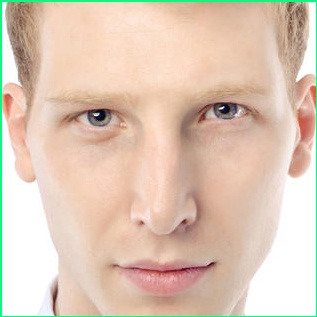

# Automatic facial detection and recognition

In computer vision there is a sub-field called **recognition**, and within that sub-field there is the field of **identification**, **detection**, and **recognition**, which is where **facial detection and recognition** is located. This sub-field is dominated by techniques in Machine Learning, which help to reduce the error in classifying new faces. 

Lets see the current process they use in Facial Recognition:

	1. Facial Detection
	2. Image Normalization
	3. Feature Extraction
	4. Matching and Classification

First there is **facial detection**, which is the section where they try and find the face in the image. Before trying to do analysis on the face itself you've to isolate the face from the image, and isolate it correctly so you don't run into problems later. This is difficult as there can be situations like bad lighting that throw the whole program off.

Next there is **image normalization**, which is fixing the alignment of the image, and making sure that the image is prepared for the next couple of steps. We now have the face, but we have to make sure that the face is correct, and that it is setup in the same way our images were trained earlier. For example, some people usually convert the image into a gray-scaled image to remove color as that's not required in some approaches to facial recognition.

Then after we perform normalization we extract features from it, and this process is called **feature extraction**. I'll go into more detail here later, but for now this is where we identify the key points on the face to feed to the matching algorithm.

Lastly, there is **matching/classification**. This is the step where we take the details from the features we have extracted, and use Machine Learning to try and classify or match the given image. There are a large number of algorithms we can use here to match or classify our input face. 

**Facial Detection**

**Image Normalization**

**Feature Extraction**

Lets say we want to extract features from the face. Now that we've detected and normalized the face, we have a image of the face itself - something like the one shown below.

There are many features we can extract from an image of the face. Lets list some potential things we can use to compare our image to another image.

1. Position of left, center, and right of each eyes
2. Position of center between the two eyes
3. Position of mouth left, mouth center, and mouth left
4. Position of nose
5. If the man is smiling or not
6. Position of left ear, and right ear
7. Gender classification - Man or Female
8. Any skin marks, such as scars

**Matching/Classification**

There is a lot of techniques used in computer vision to perform facial recognition. Here we take the features that we've extracted from the previous step, and perform some kind of analysis and comparison to the images we already have. 

In this step we require to have fed in images that we want to compare to. Meaning that before we feed in new pictures, or test images, we have to perform some analysis and classify a training set of images. Once we've done this we can start inputting new images, and see what prediction it gives. 

The process here is:

1. Train the algorithm with old images, where it knows who each person is. We need to separate out and tell the algorithm that this is Bob, or this is John. 
2. Feed in test images to see how the algorithm performs. So we'll feed in a picture of Bob, and see if the algorithm predicts Bob. If it does - it has predicted correctly! However, if it predicts John then it has predicted incorrectly.

When we feed in a test image of Bob - the algorithm will give us a confidence or likeliness that the current person is X. This means that it will give back data such as 50%, or 20% that the image is of Bob or John. Then we simply just choose the one with the highest percentage, and return that.

**Sources**

Further Resources

- [Interesting Papers in Facial Recognition](http://www.face-rec.org/interesting-papers/)
- [Short course in Recognizing and Learning Object Categories](http://people.csail.mit.edu/torralba/shortCourseRLOC/)
- [Eigenfaces, for Facial Recognition](http://jeremykun.com/2011/07/27/eigenfaces/)

Conferences to watch out

- [Automatic Face and Gesture Recognition conference (AFGR)](http://www.fg2015.org)

Key Concepts

- [Principal component analysis](http://en.wikipedia.org/wiki/Principal_component_analysis)
- [Edge detection](http://en.wikipedia.org/wiki/Edge_detection)

Publications

- [Automatic Face Recognition: State of the Art](http://biometrics.cse.msu.edu/Presentations/AnilJain_FaceRecognition_KU10.pdf)
- [DeepFace: Closing the Gap to Human-Level Performance in Face Verification](https://www.facebook.com/publications/?area=344653225606140)
- [Eigenface vs Line Edge Map](http://homepages.cae.wisc.edu/~ece533/project/f06/orts_rpt.pdf)
- [Face Recognition Using a Line Edge Map](http://cseweb.ucsd.edu/classes/fa05/cse252c/torres2b.pdf)

Questions and Answers

- [State of the art in face recognition](http://stackoverflow.com/questions/2903453/state-of-the-art-in-face-recognition?rq=1)
- [How to adaptively add and use face images collected while authentication to improve performance of face authentication?](http://stackoverflow.com/questions/12723856/how-to-adaptively-add-and-use-face-images-collected-while-authentication-to-impr)
- [Can anyone suggest good illumination normalization algos for face authentication. I have tried basic algos like DoG, LBP, ..?](http://stackoverflow.com/questions/12568901/can-anyone-suggest-good-illumination-normalization-algos-for-face-authentication)
